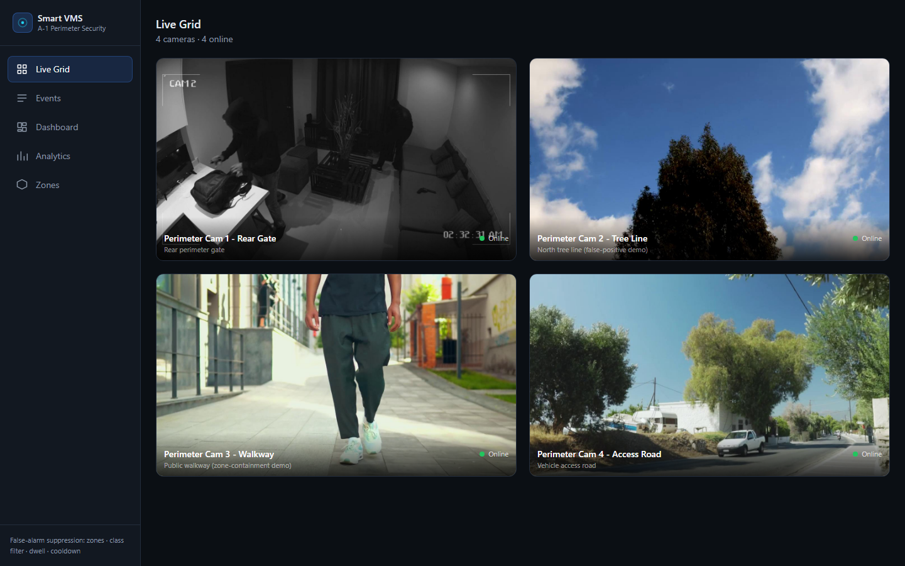
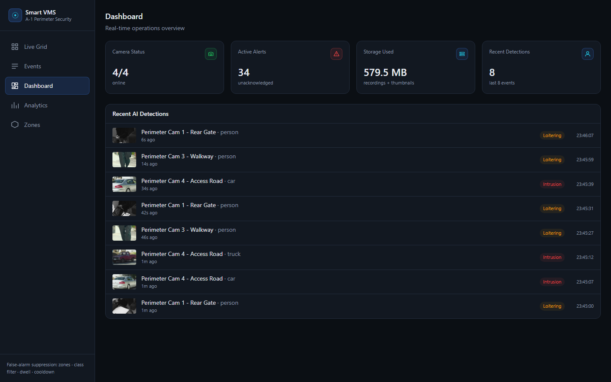
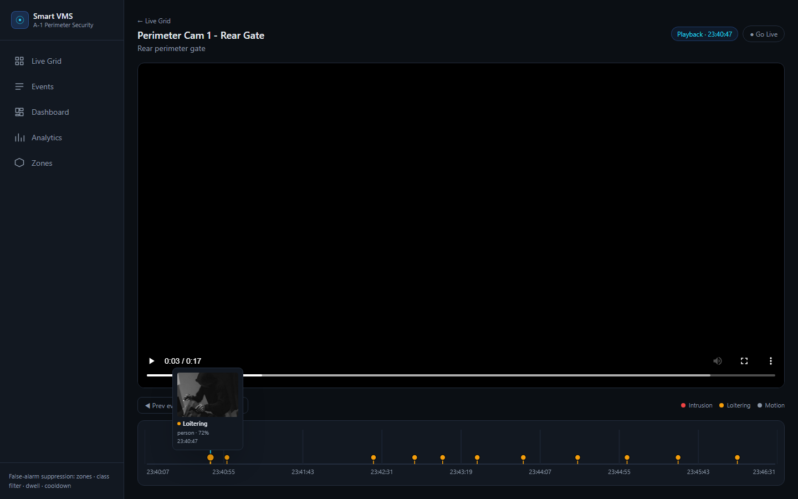
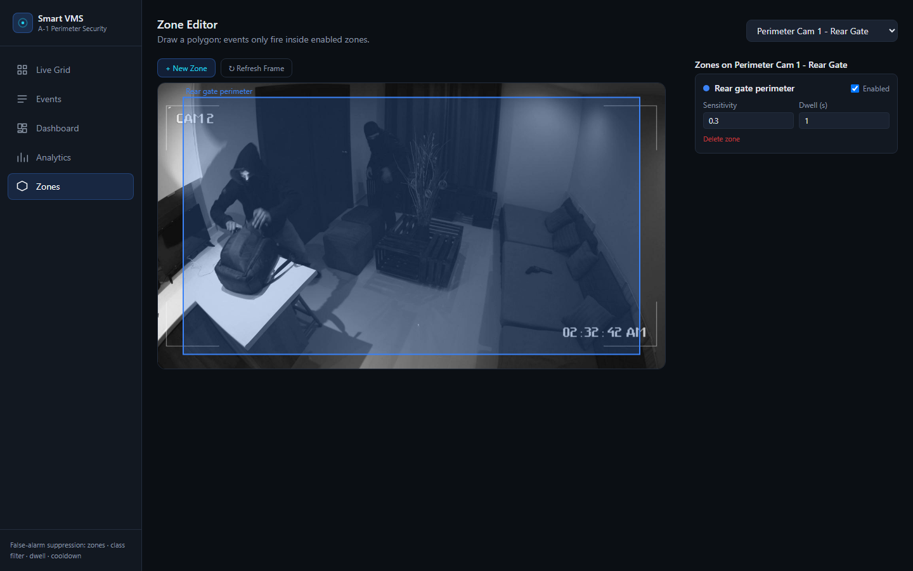
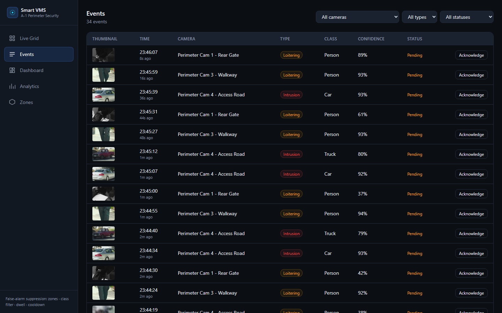
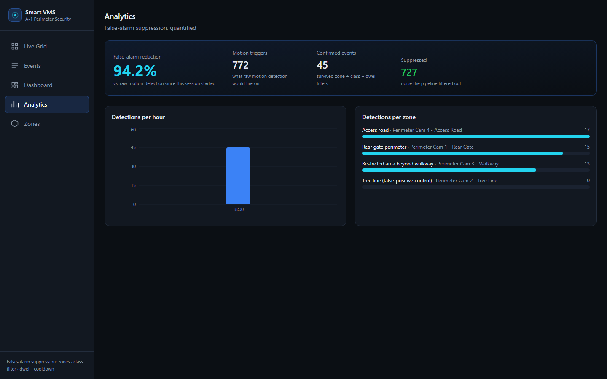

# Smart VMS — AI Intrusion Detection & False-Alarm Suppression

**Team Byte Breakers** · National Institute of Technology Delhi
Built for **A-1 Launchpad 2026 — Round 2** (Software Development / AI-ML track), Case Study: Smart Video Management System.

[](backend/) [](frontend/) [](https://github.com/ultralytics/ultralytics)

Perimeter security operators are flooded with false alerts from wind, animals, and moving foliage — enough that a genuine intrusion can get lost in the noise. This project is a video management system that keeps live monitoring and recorded playback in one interface, and filters detections through zones, object class, and dwell time so an alert generally means something actually happened. On our own test runs, that pipeline cuts false triggers by more than 90% compared to raw motion detection; the exact figure depends on the session, since it's computed from live detections rather than fixed.

**Repository:** https://github.com/Priyanshu-44/VMS-application
**Demo video:** _to be added before submission_
**API docs (when running locally):** http://localhost:8000/docs

---

## Contents

- [What this is](#what-this-is)
- [Screenshots](#screenshots)
- [The false-alarm pipeline](#the-false-alarm-pipeline)
- [Architecture](#architecture)
- [Tech stack](#tech-stack)
- [Getting started](#getting-started)
- [Project structure](#project-structure)
- [Database schema](#database-schema)
- [API reference](#api-reference)
- [What's built vs. roadmap](#whats-built-vs-roadmap)
- [Acknowledgements](#acknowledgements)

## What this is

Four camera feeds — using looped sample clips in place of physical cameras, for a reliable and repeatable demo — are ingested, recorded to disk in 30-second segments, and analyzed frame by frame. Detected intrusions land on an interactive timeline as they happen, pushed to the browser over a WebSocket, and clicking a marker seeks the recording straight to that moment.

| Screen | Route | What it does |
|---|---|---|
| Live Grid | `/` | Multi-camera grid, online/offline status, alert flash on active events |
| Playback + Timeline | `/playback/:cameraId` | Canvas timeline with colored event markers, hover-to-preview, click-to-seek, live/playback toggle |
| Events | `/events` | Filterable event table, acknowledge, jump to the exact playback moment |
| Dashboard | `/dashboard` | Camera status, active alerts, storage usage, recent detections |
| Analytics | `/analytics` | False-alarm reduction figure, detections per hour, detections per zone |
| Zone Editor | `/zones` | Draw a polygon on a paused frame, tune sensitivity and dwell time per zone |

## Screenshots

Taken from a running instance of this repository.

| Live Grid | Dashboard |
|---|---|
|  |  |

| Playback — click-to-seek | Zone Editor |
|---|---|
|  |  |

| Events | Analytics |
|---|---|
|  |  |

## The false-alarm pipeline

A raw motion detector fires on anything that moves. This system layers four checks so that only a real intrusion reaches the operator:

1. **Motion pre-filter.** OpenCV's MOG2 background subtraction runs first and cheaply — the expensive model only runs on frames where something actually moved.
2. **Object-class filter.** YOLOv8 has to classify the moving thing as a person, car, truck, bus, bicycle, or motorcycle. Leaves, shadows, and camera noise get discarded here, before a zone is ever checked.
3. **Zone containment.** The detection's centroid has to fall inside a polygon the operator drew and enabled. A point-in-polygon test against normalized coordinates.
4. **Dwell and cooldown.** A momentary detection doesn't escalate instantly — it has to persist for a configurable number of seconds. Once an event does fire, a 30-second cooldown keeps the same lingering object from generating a new alert every few seconds.

One of the four sample cameras points at a tree in the wind. It produces zero events across the whole pipeline, while the other three — an intrusion clip, a pedestrian clip, and a vehicle clip — fire correctly classified events. In one representative session, the Analytics page recorded 878 raw motion triggers against 78 confirmed events, a 91% reduction, with the tree-line zone at exactly zero.

## Architecture

```
Sample clips (looped, 4 cameras)
        │
        ▼
FastAPI backend — ingest, MJPEG stream out, H.264 segment recording
        │
        ▼
Detection pipeline — MOG2 motion gate → YOLOv8 classify → zone test → dwell/cooldown
        │
        ▼
SQLite (cameras, zones, events, recordings) + clips and thumbnails on disk
        │
        ▼
React frontend — live grid, timeline, dashboard, zone editor, analytics
        ▲
        └── WebSocket for real-time event push
```

Capture, recording, and detection each run on their own thread per camera, so recording keeps going even if detection falls behind.

## Tech stack

| Layer | Choice | Notes |
|---|---|---|
| Backend | Python 3.13, FastAPI | Async, auto-generated OpenAPI docs at `/docs` |
| Video I/O | OpenCV | Frame capture, MJPEG streaming, segment recording |
| Object detection | Ultralytics YOLOv8n | CPU-friendly, roughly 0.13–0.8s per frame depending on the scene |
| Motion pre-filter | OpenCV MOG2 | Cheap gate before the model runs |
| Video codec | H.264 via Cisco's OpenH264 | OpenCV's default `mp4v` fallback isn't playable in a browser |
| Database | SQLite | Zero-config, ships as sample data |
| Real-time | FastAPI WebSocket | Pushes new events to the UI as they happen |
| Frontend | React 19, Vite, Tailwind CSS v4 | Dark theme, canvas-rendered timeline |
| Charts | Recharts | Analytics view |

## Getting started

Tested on Windows with Python 3.13 and Node 22. No GPU and no external services are required — everything needed ships in this repository or installs through pip and npm.

### Backend

```bash
cd backend
python -m venv .venv
.venv\Scripts\python.exe -m pip install -r requirements.txt
.venv\Scripts\python.exe scripts\init_db.py
.venv\Scripts\python.exe scripts\seed_cameras.py
.venv\Scripts\python.exe scripts\seed_zones.py
.venv\Scripts\python.exe -m uvicorn app.main:app --port 8000
```

The first run also downloads the YOLOv8n weights (about 6MB) through the `ultralytics` package. API docs are served at **http://localhost:8000/docs**.

### Frontend

```bash
cd frontend
npm install
npm run dev
```

Open **http://localhost:5173**. `frontend/.env` already points at `http://localhost:8000`, so no changes are needed for a local run.

### Verifying the pipeline directly

Two scripts check the pipeline outside the browser. `verify_yolo.py` runs YOLOv8 against each sample clip and prints what it detects, confirming the classes and confidences look right. `test_ws.py` connects to `/ws/events` and prints events as they arrive, confirming the push side works.

```bash
cd backend
.venv\Scripts\python.exe scripts\verify_yolo.py
.venv\Scripts\python.exe scripts\test_ws.py
```

### Resetting to a clean state

Events accumulate for as long as the backend runs, since the demo clips loop indefinitely. Before a demo or a recording, it's worth starting from a clean database:

```bash
cd backend
rm data\db\vms.sqlite3
rm -r data\recordings\camera_* data\thumbnails\*.jpg
.venv\Scripts\python.exe scripts\init_db.py
.venv\Scripts\python.exe scripts\seed_cameras.py
.venv\Scripts\python.exe scripts\seed_zones.py
```

Restart uvicorn afterward.

### macOS and Linux

`backend/vendor/openh264-2.5.0-win64.dll` is Windows-only. Elsewhere, either install a system `ffmpeg` with libx264, which OpenCV will pick up automatically, or download the matching OpenH264 binary from [Cisco's releases](https://github.com/cisco/openh264/releases) and load it the platform-appropriate way — `.dylib` and `DYLD_LIBRARY_PATH` on macOS, `.so` and `LD_LIBRARY_PATH` on Linux. `app/core/config.py` currently only wires up the Windows path.

## Project structure

The backend is organized by concern: `api/` holds the route handlers, `core/` holds configuration and the database and geometry helpers, `services/` holds the actual pipeline logic, and `models/` holds the Pydantic schemas. The frontend mirrors the six screens under `pages/`, with the timeline living in `components/` as its own reusable piece.

```
backend/
  app/
    api/
    core/
    services/
    models/
  scripts/
  vendor/
frontend/
  src/
    pages/
    components/
    lib/
    hooks/
data/
  sample_clips/
  recordings/
  thumbnails/
  db/
docs/
  screenshots/
  demo_script.md
  pitch_pdf_content.md
prd.md
```

## Database schema

Four tables. `zones.polygon` stores a JSON array of `[x, y]` points normalized to 0–1, so it's resolution-independent. `events.type` is one of `intrusion`, `motion`, or `loitering`, depending on how long the object dwelled in the zone before the event fired.

```sql
CREATE TABLE cameras (
    id            INTEGER PRIMARY KEY,
    name          TEXT NOT NULL,
    source        TEXT NOT NULL,
    location      TEXT,
    status        TEXT DEFAULT 'online',
    created_at    TIMESTAMP DEFAULT CURRENT_TIMESTAMP
);

CREATE TABLE zones (
    id            INTEGER PRIMARY KEY,
    camera_id     INTEGER REFERENCES cameras(id),
    name          TEXT NOT NULL,
    polygon       TEXT NOT NULL,
    enabled       INTEGER DEFAULT 1,
    sensitivity   REAL DEFAULT 0.5,
    dwell_seconds INTEGER DEFAULT 2
);

CREATE TABLE events (
    id             INTEGER PRIMARY KEY,
    camera_id      INTEGER REFERENCES cameras(id),
    zone_id        INTEGER REFERENCES zones(id),
    type           TEXT NOT NULL,
    object_class   TEXT,
    confidence     REAL,
    ts             TIMESTAMP NOT NULL,
    clip_path      TEXT,
    clip_offset    REAL,
    thumbnail_path TEXT,
    acknowledged   INTEGER DEFAULT 0
);

CREATE TABLE recordings (
    id          INTEGER PRIMARY KEY,
    camera_id   INTEGER REFERENCES cameras(id),
    start_ts    TIMESTAMP NOT NULL,
    end_ts      TIMESTAMP,
    file_path   TEXT NOT NULL,
    size_bytes  INTEGER
);
```

See [`backend/app/core/db.py`](backend/app/core/db.py) for the version the application actually runs against.

## API reference

The full interactive documentation is at `/docs`. In summary:

| Method | Endpoint | Purpose |
|---|---|---|
| GET/POST | `/cameras` | List or register cameras |
| GET | `/cameras/{id}/stream` | MJPEG live stream |
| GET | `/cameras/{id}/snapshot` | Single still frame, used by the zone editor |
| GET | `/cameras/{id}/zones` | Zones for a camera |
| POST/PUT/DELETE | `/zones`, `/zones/{id}` | Create, update, or remove a zone |
| GET | `/events` | List events, filterable by camera, type, or time range |
| GET | `/events/{id}`, `/events/{id}/thumbnail` | Event detail or thumbnail image |
| POST | `/events/{id}/acknowledge` | Dismiss an alert |
| GET | `/recordings/{camera_id}` | Segments within a time window |
| GET | `/playback` | Stream a recording, seeked by event ID or by camera and timestamp |
| GET | `/dashboard/stats`, `/analytics` | Dashboard tile data, analytics data |
| WS | `/ws/events` | Real-time event push |

## What's built vs. roadmap

Everything in the tables above is implemented and has been re-verified end to end — backend boot, both verification scripts, all six frontend pages, and interaction tests for acknowledging an alert and clicking a timeline marker to seek. `prd.md` Section 5 has the original scope split between the MVP and the two win-booster features (zones and analytics); both are built.

Deliberately out of scope for this prototype: real RTSP or ONVIF camera integration, cloud storage and retention, authentication and audit trails, face or license-plate recognition, native mobile apps, direct integration with A-1's Vigil PIDS sensor network, and edge deployment. These are listed as roadmap items in `prd.md` Section 20.

One known limitation: under heavy CPU load, a gap of more than a few seconds between qualifying detections can reset an object's tracked dwell time, which occasionally produces a duplicate event sooner than the cooldown would otherwise allow. This comes from tracking by zone and object class rather than true multi-object identity, and is noted in [`backend/app/services/tracker.py`](backend/app/services/tracker.py).

Ultralytics YOLOv8 is AGPL-3.0 licensed for non-commercial use, with a separate commercial license available from Ultralytics. That's fine for this prototype, but worth flagging as a real decision if the pipeline goes further with A-1.

## Acknowledgements

- [Ultralytics YOLOv8](https://github.com/ultralytics/ultralytics) (AGPL-3.0) — object detection model, weights downloaded from Ultralytics' official GitHub releases
- [OpenCV](https://opencv.org/) (Apache 2.0) — video capture, MOG2 background subtraction, video I/O
- [Cisco OpenH264](https://github.com/cisco/openh264) ([binary license](http://www.openh264.org/BINARY_LICENSE.txt)) — H.264 encoder, vendored at `backend/vendor/openh264-2.5.0-win64.dll`, needed so recordings play in a browser
- [FastAPI](https://fastapi.tiangolo.com/) (MIT) — backend framework and OpenAPI docs
- [React](https://react.dev/), [Vite](https://vitejs.dev/), [Tailwind CSS](https://tailwindcss.com/), [Recharts](https://recharts.org/), [react-router-dom](https://reactrouter.com/) (all MIT) — frontend
- Sample surveillance clips from [Mixkit](https://mixkit.co/) (Mixkit Stock Video Free License, no attribution required):
  - ["Two thieves recorded on a security camera"](https://mixkit.co/free-stock-video/two-thieves-recorded-on-a-security-camera-31372/) — intrusion clip
  - ["Tree, wind and clouds in the blue sky"](https://mixkit.co/free-stock-video/tree-wind-and-clouds-in-the-blue-sky-30260/) — false-positive control clip
  - ["Footsteps of a young man walking down the street"](https://mixkit.co/free-stock-video/footsteps-of-a-young-man-walking-down-the-street-4893/) — pedestrian clip
  - ["Cars passing on a street in a town"](https://mixkit.co/free-stock-video/cars-passing-on-a-street-in-a-town-2872/) — vehicle clip

---
